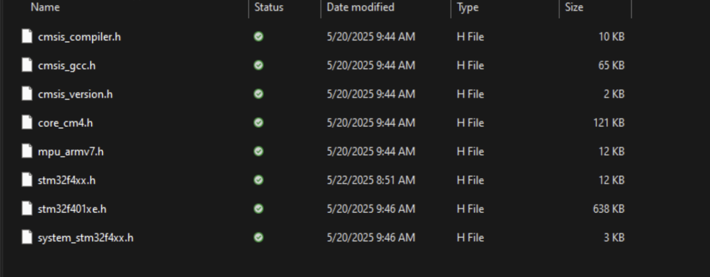

# Camera with STM32 and OV7670

## Getting Started
---

I wanted to start out by creating a simple UART script to flash to my STM32. This would give me an introduction to the compilation tools I would need, help me create a simple user-defined UART library I could then use to debug later on, and also give me an idea of how my makefiles should look for future updates. I also will avoid installing the STM32Cube IDE, since I want to work more bare-metal, and try to handle memory and registers myself.

### Progression

#### arm-none-eabi toolchain - 5/20/25

Downloaded the .exe file off the ARM official downloads page. Took incredibly long despite being only 203MB. 

Installed with no issues. Also added to PATH and verified using arm-none-eabi-gcc --version.

#### Open On-Chip Debugger (OpenOCD)

Downloaded and installed, no hiccups. Added to PATH.

#### ST-Link - 5/25/25

Installed with no issues.

#### Dependencies

I grabbed a couple files from the [ST electronics github repository](https://github.com/STMicroelectronics/STM32CubeF4) in order to satisfy dependencies and simplify working with registers on the STM32, and then rearranged my project directory so that it’s more organized. The file organization will look about the same for different stages of the project, give or take some additional libraries, but it makes it easier to work with since I won’t have to modify the makefile much at all for most parts of the project.

So far, the files are organized like this:
Camera/
	Test_code/
		inc/
		src/
		startup/
		system/
		linker/
		makefile

startup/: contains startup_stm32f401xe.s. This preps the board for running the main code
system/: contains system_stm32f4xx.c. It defines the clock source and vector table location.
linker/ contains the linker file, linker.ld
src/ contains my source code, main.c, and library files, which I will put in a subdirectory called lib/
inc/: contains the following, which are dependencies required by system_stm32f4xx.c.

Most of the issues I had in this part of the project were due to missing dependencies, which I combed through the STM32CubeF4 repo for, so I restarted several times, trying different organizations that I thought would work. Eventually, I settled on this, and my code compiled successfully when I ran `make`, so I stuck with it. 

#### Installing ST-Link Driver
When I tried to run `make flash`, I got back errors claiming that there were no “st-link devices” available. I found out that I needed to install a driver, for which I used [Zadig](https://github.com/pbatard/libwdi/wiki/Zadig) to satisfy. Now I was able to flash my code to the board successfully. The final step in getting the project off the ground is to check if I can use register names and bitwise operations to operate the LEDs on-board, just to see if the dependencies are fully functional.

### Concepts Learned

#### Linkers

A linker file helps create an executable from the compiled .o files a makefile produces. In a nutshell, a linker takes all the object files a makefile creates and “links” them into one executable. More elaborately, it resolves symbols (variable names), arranges memory layout (where each piece of code goes) and produces a .elf or .bin file. 

Linkers are needed in microcontrollers since there is no OS handling the executables and mapping it in memory.

A typical linker script has the following skeleton:
+   Memory regions: Where we define the start of Flash memory and RAM and their lengths
+   Sections: Defines sections such as .text for code, .data for uninitialized variables, .bss for zeroed variables, and .isr_vector for the interrupt vector table.

My linker.ld file modifies the Memory regions according to the size of flash and RAM on my Nucleo STM32F401RE. It additionally has an entry point demarcated by ENTRY(Reset_Handler), which indicates to the CPU which address to jump to when the board is reset.
---

\\

## Setting up Communication and Delays
---
### Progression

#### Setting up USART communication - 5/29/25

From the documentation and a forum online, I discovered that USART2 allows communication through USB via ST-Link’s VCP (Virtual COM Port). I worked on setting up UART the entirety of this week (5/26 to 5/30). I could’ve finished it in an hour, realistically, but I really tried to delve into how the code should be structured and how to work with STM32 bare metal, since it ended up being vastly different from what I learnt using “avr/io.h” for ATMega328p. 

Eventually, I successfully created my uart.c and uart.h files for use in later iterations of my software.

#### Setting up delays - 5/30/25
This is more of a side learning endeavor, since I didn’t fully pay attention to timers and counters in my embedded systems class. I tried using a simple __asm__(“nop”) function (perform nothing this clock cycle) in a while loop for delays, but that proved to be increasingly inaccurate the larger the delay got, considering using a decrementing count variable in a while loop itself uses a couple clock cycles.

I set out to use a TIM-based delay library, partially so that I could figure out how timers work in practice. 

I’ve successfully created TIM based delays. It’s very simple, but my primary issue with this was figuring out how the prescaler works. The peripheral buses (APBs) on STM32F401RE have their own clocks, and the TIM has a doubled clock frequency compared to these. Initially, I set the prescaler register to the divisor based on the original 16MHz clock speed, which was wrong, so my delay test using putty was significantly off the mark.

### Challenges

One of the biggest issues I overcame here was understanding how to read the documentation and implement it directly in code. The instructions in the STM32F4 reference manual were a little vague, and I didn’t realize how much I would have to depend on “stm32f401xe.h” (in my inc/ folder) in order to implement my code (considering it was full of constants and structs I would need to activate peripherals).  Additionally, as I tried to work my way through this, I didn’t realize that the reference manual was “cumulative” in that I would need to read pretty much everything preceding the current topic of interest to code anything related to it. For example, I directly jumped to the instructions to USART. Only later in the process of setting up UART did I notice that I needed to explicitly enable the clock for that peripheral: I mistakenly assumed the processor would use the main 16MHz clock for peripherals.

### Concepts Learned

---